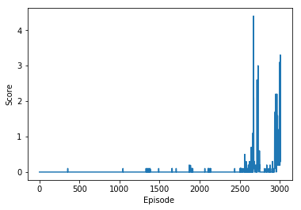

## Environment

Number of agents: 2
Size of each action: 2
There are 2 agents. 

* Number of agents: 2
* State Space: each observes a state with length: 24
* Action Space: Each action is a vector with 4 numbers, corresponding to torque applicable to two joints, 
values in action vector must be a number between -1 and 1
* Rewards: +0.1 for each step that the agent's hand is in the goal location
* Goal: acheiving a high accumulated score per episode that is 0.5 average over window of 100 episodes

## Background

Recent implementation of “Deep Q Network” (DQN) algorithm has acheived a signficant progress in Reinforcement Learning, resulting in human level performance in playing Atari games.
DQN is capable of solving problems with high-dimensional state space but faces limitations in dealing with high-dimensional continous action space and requires iterative optimazation process at each step.

For this experiment, I used a model-free, off-policy actor-critic algorithm using deep function approximators
that can learn policies in high-dimensional, continuous action spaces and uses some of the deep learning tricks that were introduced along with Deep Q-Networks.
This algorithm is fully explained in [Continuous control With Deep Reinforcement Learning](https://arxiv.org/abs/1509.02971) paper and it is built off Deterministic Policy Gradients to produce a policy-gradient actor-critic algorithm called Deep Deterministic Policy Gradients (DDPG).

### MutliAgent

Here I have implemented a single DDPG agent which acts as a multiagent DDPG by taking in 2 states and generating 2 actions to feed back to the environment,
at each step, I add a record of <state, action, reward, next_state, done> to the buffer memory of agent and wait for the memory to fill up to the bacth_size before starting to learn from the replay buffer.

Note: I also tried to implement MADDPG as a single agent with a shared memory and shared networks but I coulnd't manage to fix it and left oit for future work.

I ran multiple experiments with various configurations, here is the summary of experiments and their results:

Base hyperparameters are:
  - buffer_size: 100,000 tuples, 
  - batch_size: 64
  - learning_rate_actor: 1e-4
  - learning_rate_critic: 1e-4
  - gamma (discount factor): 0.99
  - tau (soft update interpolation rate): 0.001
  
### Experiment_1:

* Actor Network:
  * (fc1): Linear(in_features=24, out_features=64, bias=True)
  * (fc2): Linear(in_features=64, out_features=32, bias=True)
  * (fc3): Linear(in_features=32, out_features=2, bias=True)
* Critic Network:
  * (fc1): Linear(in_features=24, out_features=64, bias=True)
  * (fc2): Linear(in_features=66, out_features=32, bias=True)
  * (fc3): Linear(in_features=32, out_features=1, bias=True)
* Best score: 0.509000007584691
* Ended in 3733 of episodes

### Experiment_2:

* Actor Network: 
  * (fc1): Linear(in_features=24, out_features=128, bias=True)
  * (fc2): Linear(in_features=128, out_features=64, bias=True)
  * (fc3): Linear(in_features=64, out_features=32, bias=True)
  * (fc4): Linear(in_features=32, out_features=2, bias=True)
* Critic Network:
  * (fc1): Linear(in_features=24, out_features=128, bias=True)
  * (fc2): Linear(in_features=130, out_features=64, bias=True)
  * (fc3): Linear(in_features=64, out_features=1, bias=True)
* Best score: 0.509000007584691
* Ended in 3673 of episodes.

### Experiment_3:

* Actor Network: 
  * (fc1): Linear(in_features=24, out_features=128, bias=True)
  * (fc2): Linear(in_features=128, out_features=64, bias=True)
  * (fc3): Linear(in_features=64, out_features=32, bias=True)
  * (fc4): Linear(in_features=32, out_features=16, bias=True)
  * (fc5): Linear(in_features=16, out_features=2, bias=True)
* Critic Network:
  * (fc1): Linear(in_features=24, out_features=128, bias=True)
  * (fc2): Linear(in_features=130, out_features=64, bias=True)
  * (fc3): Linear(in_features=64, out_features=1, bias=True)
* Best score: 0.5254000079631805
* Ended in 3733 of episodes.

### Conclusion:

The last experiment acheived higher results faster in fewer episodes, this network has only 2 layers with less nodes and it seems to be the best configuration for this environment,
whereas the other network had more layers with larger hidden nodes.

Local networks for this experiments are saved in this repository.

### Future Work:

- Solving Soccer challenge 
- Implementing a multiagent ddpg with shared buffer and shared target network

